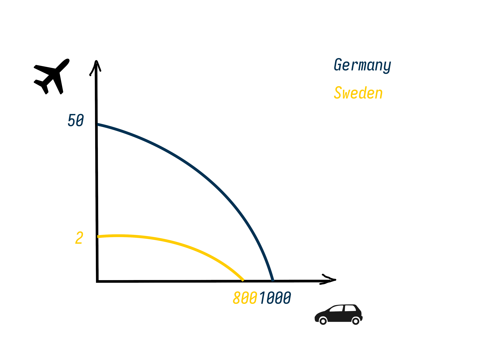

Economic systems
================

1. Give 5 examples of economic systems.

Classical political economy
===========================

1. Explain the reigning theory of value in classical political economy.

2.
	* What are the marginal opportunity costs of planes and in this
	  beautifully drawn example?
	
	* What are their respective comparative advantages?

	* What (if anything) should each of them specialize in according to
	  Ricardo’s theory of comparative advantages, and why? Demonstrate and
	  explain!
	
3. Explain Ricardo's theory of rent.

Challenge
=========

!This is not obligatory!

* Find an **academic** article online (google scholar, oria or equivalent is
  helpful), and summarize some of its theoretical arguments.

