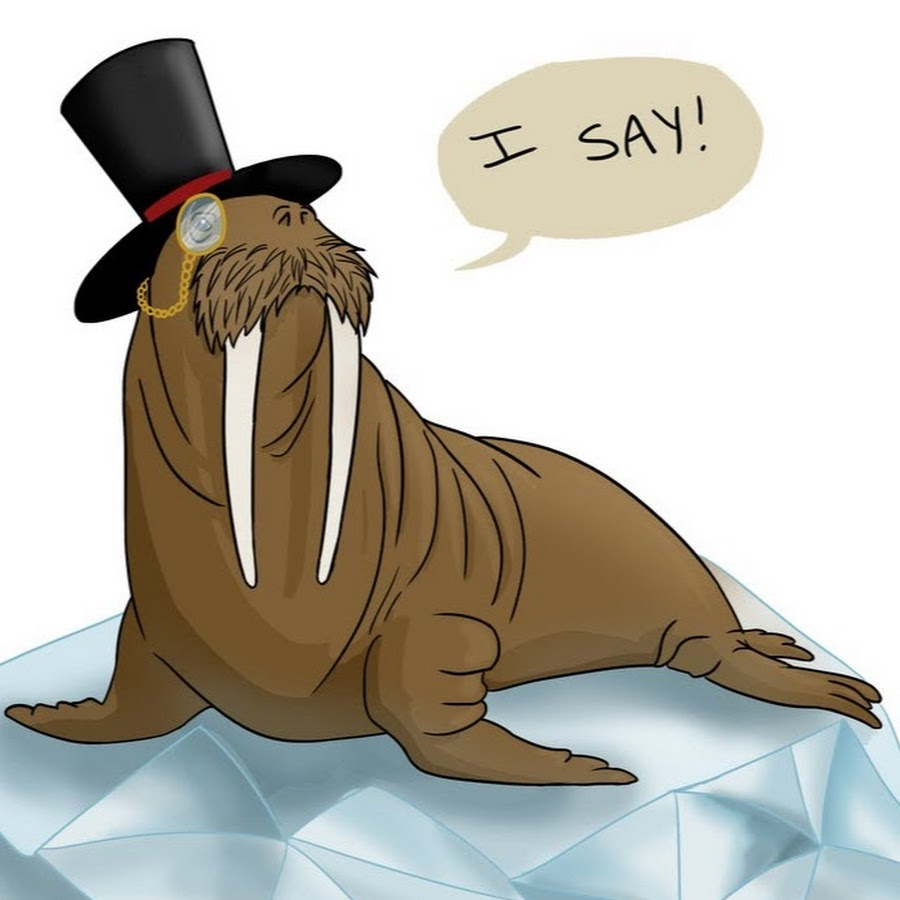
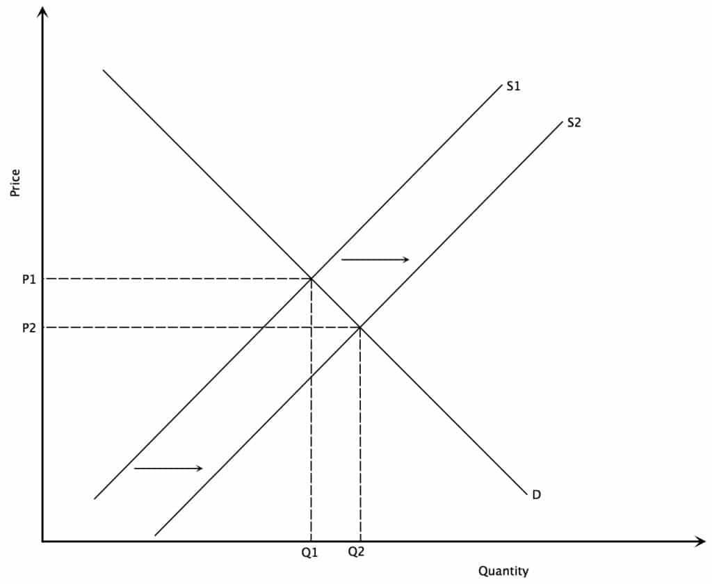

# Classical and Neo-Classical Political Economy

## 7 Things You Need to Know

# 1. The Theories of 4 Classical Political Economists

## <font color="dodgerblue">**Adam Smith 1723-90**</font>{data-background="img/autopilot.jpg"}
## <font color="dodgerblue">**Adam Smith 1723-90**</font>{data-background="img/vs.jpg"}
## <font color="black">**David Ricardo 1772-1823**</font>{data-background="img/banana.jpg"}
## <font color="white">Thomas Malthus 1766-1834 </font>{data-background="img/malthus.jpg"}
## <font color="white">**Jean-Babtiste Say**{data-background="img/cargo.jpg"}
**1767-1832**</font>

     
# 2. It's the Historical Context, Stupid!
## 2. It's the Historical Context, Stupid!
- Revolutionary Times
- Common Themes

# Neo-Classical

# 3. Strong Assumptions

# 4. Lead to Strong (testable) Predictions

# 5. Contributors and Contributions

## 5.1 Contributors 
- Léon Walras (1834-1910)
- 
```{r, echo=F}

```

## 5.1 Contributors 
- Léon Walras (1834-1910)
- William Stanley Jevons (1835-82); Carl Menger (1840-1921)
- **Alfred Marshall (1842-1924)**

## Supply-Demand

```{r, echo=F}
knitr::include_graphics("img/increaseDemand.jpg")
```

## Supply-Demand

```{r, echo=F}

```

## 5.2 Contributions
- Value
- Utility
- Consumers and Firms

# 6. Distribution and Welfare Economics

# 7. Similarities and Differences from Classical Political Economy


