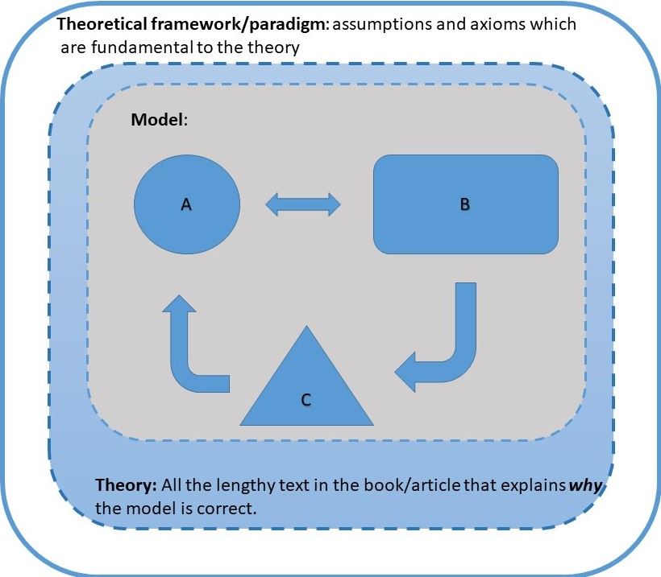
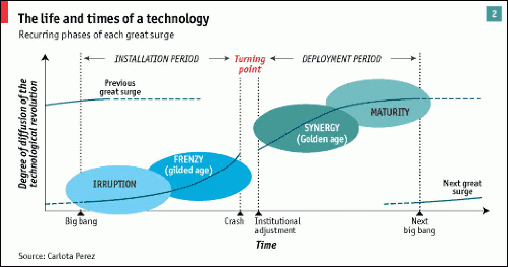
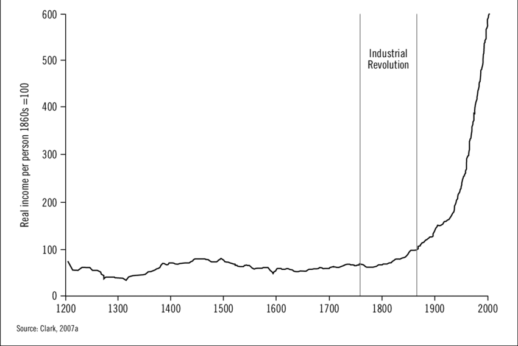
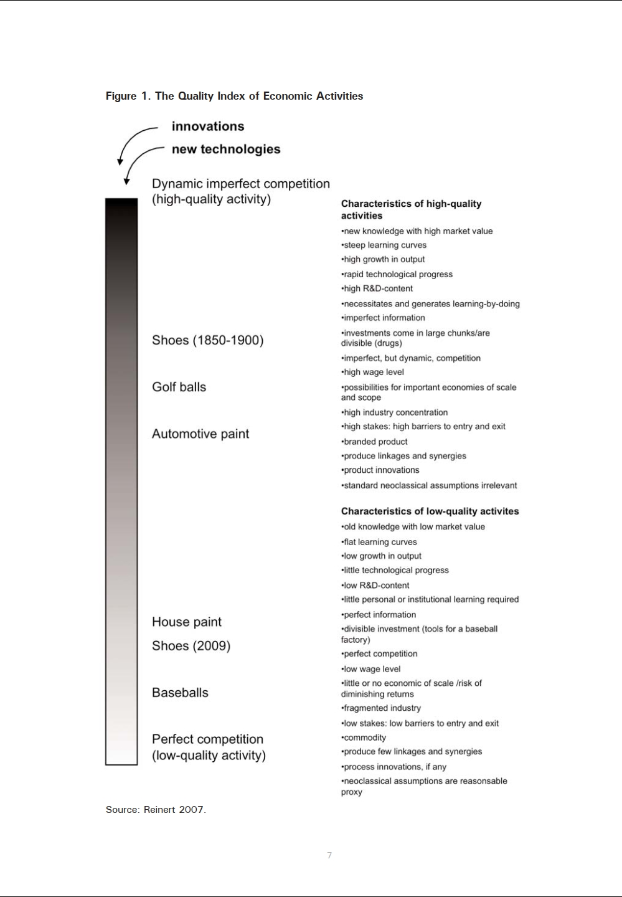
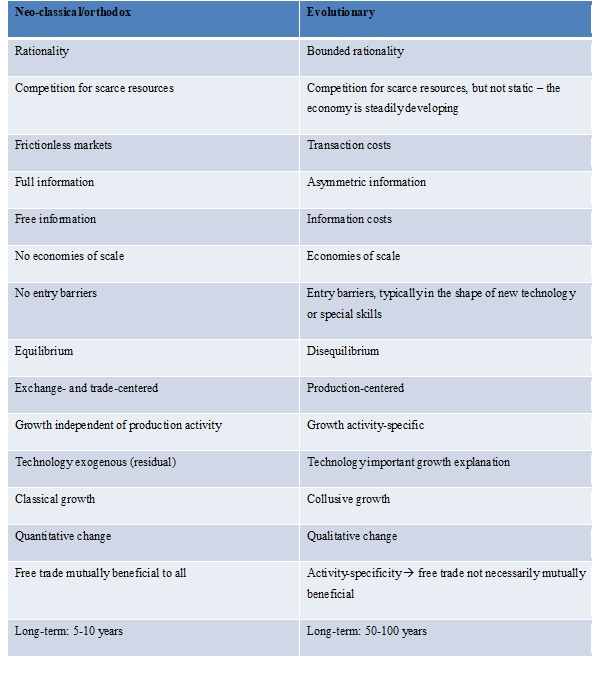
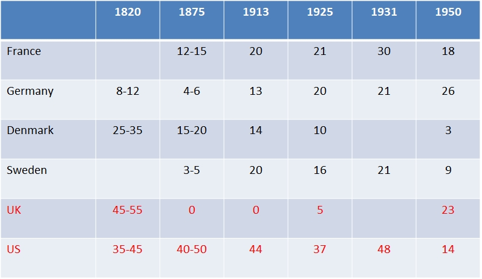

## Stuff you missed

```{r, echo=FALSE}
knitr::opts_chunk$set(echo = F)

```

- "Unit of analysis"

## Evolutionary Economy

##{data-background="img/Athens.jpg"}
<blockquote>
<h2>Epistemology</h2>
- Plato vs Aristotle
</blockquote>

## Evolutionary Economy

- How have countries grown historically?
- Types of economic growth

## Structural change

- Shumperters "creative destruction"

<p class="fragment">
```{r}

```
</p>

## Shumpeter
<p class="fragment">
```{r}

```
</p>

##
Quality of Economic Activity
```{r}

```

## Neo-classical/orthodox vs Evolutionary

```{r, out.height = "500px", out.width = "400px"}

```

## Trade and Production (Reinert)

- Sequencing

<p class="fragment">
```{r, out.height = "400px", out.width = "600px"}

```
</p>

## Trade and Production

```{r, warning=FALSE}
source("Tradefreedom.R")
```

## Studwell 

- Shining example of evolutionary economy

- But also of its shortcomings


