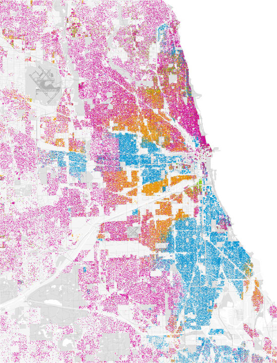

## <q>"Modern Political Economy"</q>

- TBA

## Current Mainstream

- Neoclassical + Kenesianism <p class="fragment">$+$ Monetarism <p class="fragment">$+$ Neoliberalism <p class="fragment">$+$ Trumpism?/populism?/protectionism?

## <font color="white">Dissidents</font>{data-background="img/protest.jpg"}

<blockquote>
- Maxtists
- Institutionalist
- (post-) Keynesians
</blockquote>

## {data-background="img/moreprotest.jpg"}

<blockquote>
- Even more Dissent
- Feminism
- Enviromentalism
- Evolutionary Economics
- Behavioral Economics
</blockquote>

## {data-background="img/nudge.jpg"}

## <q>"New"</q> Themes in Political Economy

## <q>"New"</q> Themes in Political Economy {data-background-video="img/climate.mp4"}

- Nature

## {data-background="img/noforest.jpg"}

## <q>"New"</q> Themes in Political Economy 

>- Nature
- Technology

```{r, echo=FALSE, out.width="400px"}
knitr::include_graphics("img/tech.jpg")
```


## <q>"New"</q> Themes in Political Economy

>- Nature
- Technology
- Society           
```{r, echo=FALSE, out.height="350px"}

```

## <q>"New"</q> Themes in Political Economy

>- Nature
- Technology
- Society
- State
```{r, echo=FALSE, out.height="310px"}
knitr::include_graphics("img/state.jpg")
```
