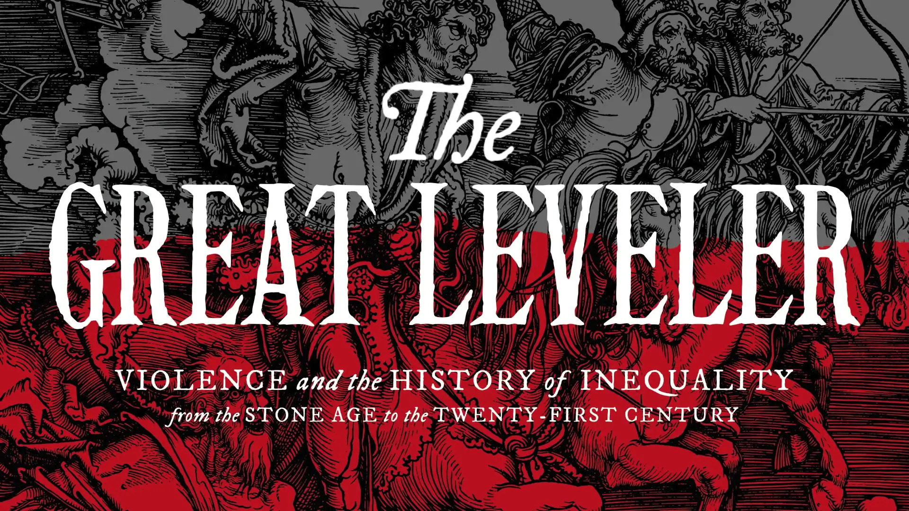
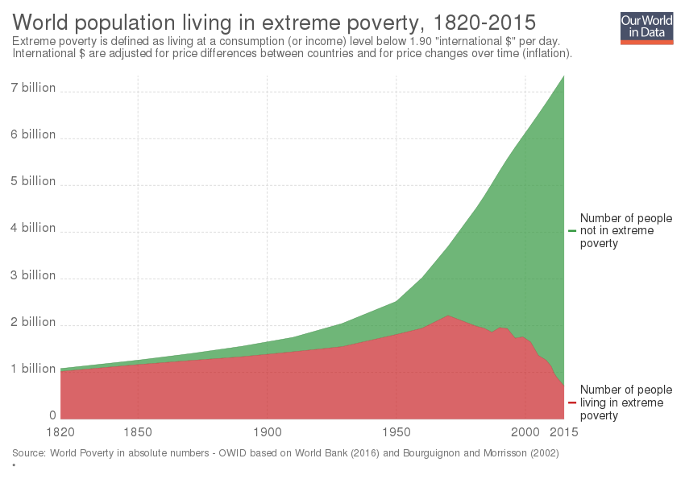

##Inequality

##Inequality of what?
- Social$$\neq$$economic <p class="fragment">$$\neq$$income</p><p class="fragment">$$\neq$$wealth</p>
- etc

## American Inequality
```{r, echo=F, warning=FALSE}
knitr::opts_chunk$set(echo = F)
source("scripts/USinequality.R")
```

## Chinese Inequality
```{r, warning=FALSE}
source("scripts/CNinequality.R")
```

## <font color= "white">Not a zero sum game! {data-background="img/zerosum.jpeg"}

<h4>
- Two broad trends lead to the same effect
- Every one is getting richer - some started with more
- The rich are getting richer faster than the rest
</h4></font>

## What are the consequences?
- Decrease in economic growth? 
- Social mobility? 
    - From meritocracy to plutocracy? 
- Protest parties and democratic degeneration 
- Health?
- Riots? Revolution? 
- Erodes social cohesion, reduces trust and legitimacy

## <font color="white">Causes?</font> {data-background="img/piketty.jpg"}
<div style="max-width:854px"><div style="position:relative;height:0;padding-bottom:56.25%"><iframe src="https://embed.ted.com/talks/thomas_piketty_new_thoughts_on_capital_in_the_twenty_first_century" width="854" height="480" style="position:absolute;left:0;top:0;width:100%;height:100%" frameborder="0" scrolling="no" allowfullscreen></iframe></div></div>

##Causes?
- Just a "natural" tendency?
- Globalization?
- Financial bubble?
- Politics?

##Politics
- Taxes until the late 1970s were much higher 
- Race to the bottom?
- Manipulation of the financial system
     - Enabled by regulations lobbied for by the financial sector

##<font color="white">Response to Piketty {data-background="img/piketty.jpg"}
- Goes(2016): Observed increases in income inequality largely uncorrelated with changes in r > g.
- Acemoglu & Robinson (2015): Institutions!
    - r > g not unimportant (does lead to more inequality), but many other variables quantitatively more important
- Stiglitz: Two forms of capital
</font>

##<font color="white">Response from Piketty {data-background="img/piketty.jpg"}
- Institutions ARE important. 
- r > g is important no matter what
- Data indicates that only wars and revolutions have mitigated wealth concentration. 
- This is a problem no matter what!
</font>

##Soulutions?
<p class="fragment">
```{r}

```
</p>

## Soulutions?
- Progressive taxation
    - Public tax records? 
- Global cooperation

## Soulutions? {data-transition="none"}
```{r}
knitr::include_graphics("img/thisisfine.jpg")
```

##
```{r}

```

