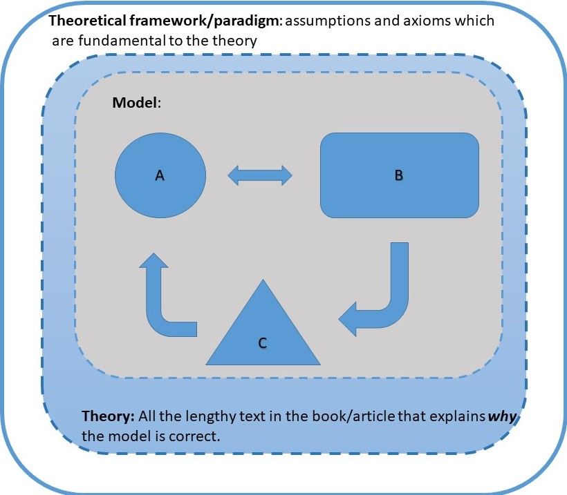

## Economic Systems 
 - Four things you need to know
----

##  1. The Seven Dimensions of Economy and Society
  - Nature
  - Markets
  - State
  - Class
  - Gender and Ethnicity
  - Social Capital
  - Ideology

----

## 2. The Four Dimensions of Economic Performance

 - Efficiency
 - Equity 
 - Sustainability
 - "Compatability with social goals"
  - i.e. growth
 -  ... but the greatest of these is growth 
 
----

## 3. What is Capitalism?
- Free markets?
- Privatly owned factors of production?
- "An *economic system* which is *dominated* by free *wage earning* workers who generate surplus value for owners of capital in terms of the difference between the wages paid to the worker and the value of the *commodity* produced by him/her."
- Idiology

----

4. Models, Theories and Paradigms
```{r, echo=FALSE}
# Sun spot theory as an example of a theory very much a product of its paradigm (classical/neoclassical)

```

## Theories vs. Policy, Arguments vs. Opinions

## 4. Models, Theories and Paradigms
- What matters is how you use it