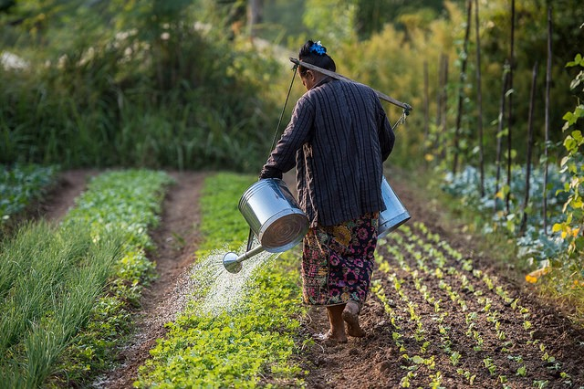
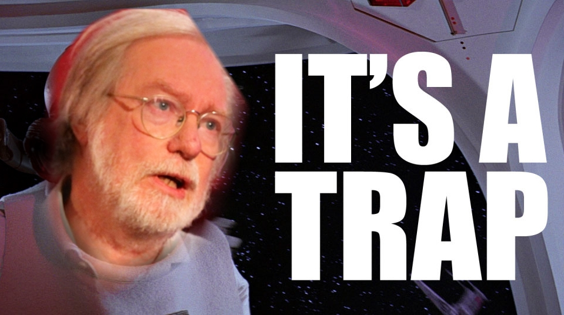
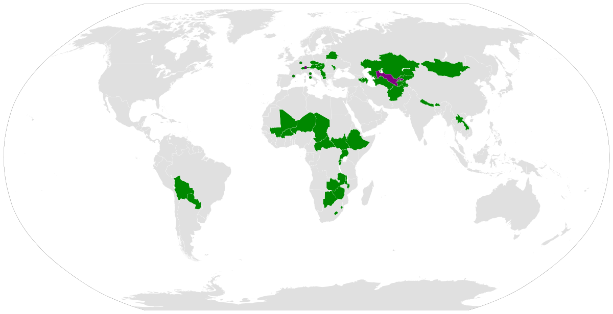
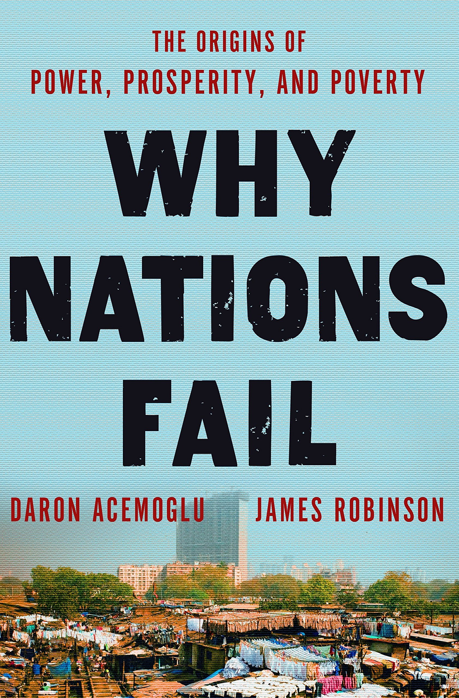

## Stuff you missed pt.2

- Labor Theory of Value
- Theory $$\neq$$ policy prescriptions
- Free market $$\neq$$ free trade

## Evolutionary Economy pt.2 and Globalization

## Studwell

```{r, echo=F, out.height = "426px", out.width = "640px"}
knitr::opts_chunk$set(echo = F)

```

## Studwell 

```{r, out.height = "600px", out.width = "400px"}

```

## Studwell 

```{r, out.height = "600px", out.width = "700px"}
knitr::include_graphics("img/benjamins.jpg")
```

## Studwell 

- Shining example of evolutionary economy

- But also of its shortcomings

## Globalization and Development

- Increasing interconnection of the global economy (the framework within which modern economies develop)
- International and national outcomes

## Paul Collier

```{r, out.height = "500px", out.width = "850px"}

```

## Colliers Traps

##{data-background="img/conflict.jpg"}

<blockquote>In 40% of countries with a recent civil conflict, the civil war recurs within a decade (Collier,
Hoeffler, and Söderbom 2008)</blockquote>

##{data-background="img/littlevenice.jpg"}

<blockquote><h1>Resource Trap</h1></blockquote>

##
```{r, warning=FALSE}
source("scripts/oil.R")
```

##
```{r, warning=FALSE}
source("scripts/oil2.R")
```

## Landlocked with bad neighbours
```{r}

```

## Bad Governance in a Small Country

<p class="fragment">
```{r}
knitr::include_graphics("img/siv.jpg")
```
</p>

## Trade your way out!

- What can "we" do?
- What should "the bottom billion"" do?
  - Stop subsidizing and liberalize trade
  - Quit aid
  - Diversify Exports

## Globalization is Colliers Answer, but...

<p class="fragment">
<q> "The problem is how to get firms over that initial hump of competitiveness and enable them to get on the escalator [of productivity growth]"</q>
</p>

- Protection from Asia

## 

```{r}

```

## Acemoglu & Robinson

- Inclusive or extractive institutions

## How best achieve growth?
- Let's check in with our other paradigms

## <font color="black">My man Francis</font> {data-background="img/francis.jpg"}

- What paradigm is this?
- Are American institutions in Decay?

## Is Eternal growth possible?

## Crystal ball
- 1980s -> Neoliberal economic and political order replacing a Keynesian order
- 2008 the end of the neoliberal political economy?
	- Doesn't look like it: finance regrouped (too big to fail)
- 2016 the end ot the neoliberal political economy?
	- Brexit, Trump, populism

