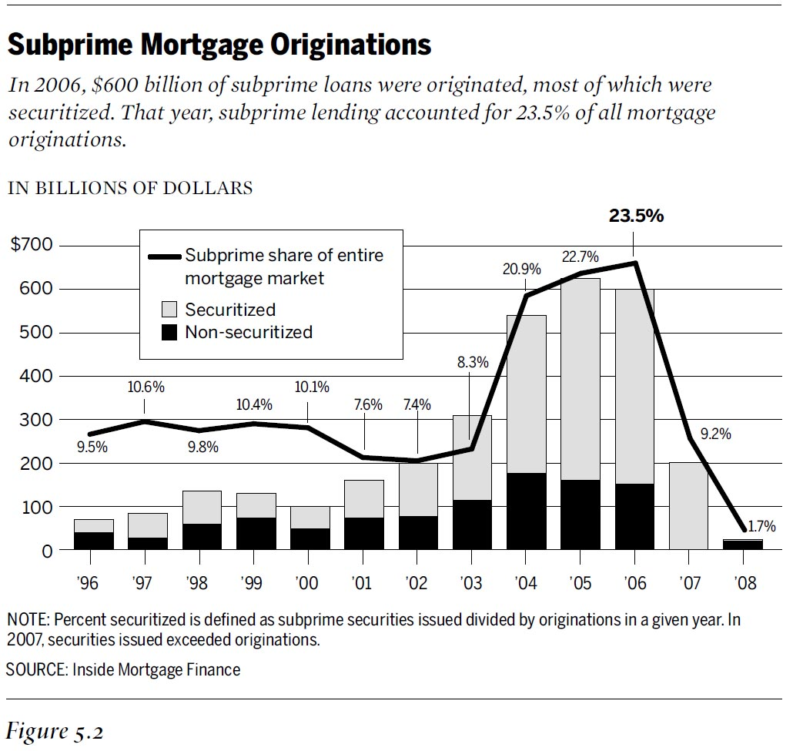

## The Global Financial Crisis
```{r, echo=FALSE, out.height=350, out.width=650}
knitr::opts_chunk$set(echo = F)
knitr::include_graphics("img/crash.jpg")
```

## Real Estate bubble
- Home prices up 60%, 2000-2006
- Subprime loans
- Securitization

## 
```{r, echo=FALSE}

```

## Not a New Phenomenon
1720s: South Sea Bubble - 
1790s: Canal mania - 
1840s: Railway mania - 
1890: Baring crisis - 
1929: Great Depression - 
1997-98: Asian financial crisis - 
2001: Dot.com bubble

## Why?
- Schumpeterians: <p class="fragment">Financial crises are linked to long economic waves. (Empirically 50-60 years.) </p>
- Marxists: <p class="fragment">Capitalism creates financial crises </p>
- Keynesians: <p class="fragment">Financial crises occur when we don't regulate capitalism </p>
- Neoclassics: <p class="fragment">Government involement creates artificial markets and inefficiencies</p>

## Asian Financial Crisis
```{r}
knitr::include_graphics("https://upload.wikimedia.org/wikipedia/commons/d/d2/Asian_Financial_Crisis_EN-2009-05-05.png")
```

## Asian Financial Crisis; systemic problems 
- Banking systems still underdeveloped
- Foreign loans
    - What if there is a devaluation?
- Quasi-contractual relationships between political and economic elites
     - Moral hazard
- Dollar peg
      - Dollar appreciates -> local currencies appreciate

## Asian Financial Crisis; Shit Hits the Fan
- Moral hazard -> Bad Loans
    - Real estate bubble
    - Insolvent banks and financial institutions
- Dollar peg
    - Appreciating dollar -> Overvalued local currencies -> Speculative attacks
- Massive outflows of capital
    - Foreign exchange reserves drained
    - From fixed to float, depreciations
  
## Response
- $200 billion injected into the market by the Fed, the ECB and the Bank of England
- Expansionary monetary policy -> low interest-rates.
- United States continued stimulus in the range of $800 billion
- ECB turned to fiscal discipline
  - Sovreign debt

## The problem of diversity
- What is appropriate for Germany may not be appropriate for certain other EU countries
- And vice-versa
- The United States has this problem too!
- BUT, its easier to get Americans to bail out fellow Americans

## And who did better?

<iframe src="https://data.worldbank.org/share/widget?contextual=default&end=2017&indicators=NY.GDP.PCAP.KD.ZG&locations=FR-DE-IT-GB-US&start=2007&view=chart" width='800' height='500' frameBorder='0' scrolling="no" ></iframe>


## 
```{r}

```

## Lazy Greeks or Austerity?

```{r}


```

## Some perspectives
- Piketty: "Germany has never repaid its debts. It has no right to lecture Greece."
  - Two ways to repay debt:
    - Strict budgetary discipline over 100 years
    - Inflation, tax on private wealth, debt relief
- Krugman: Eliminating deficits during a crisis is a recipe for depression. Leave the Euro.
- Ferguson: Clean slate makes no sense if the problem is structural (see Fukuyama ch6 for account of some of Greece's structural problems).

## Ferguson has Opinions
<iframe width="560" height="315" src="https://www.youtube.com/embed/77xI4QGMGYM?start=21" frameborder="0" allow="autoplay; encrypted-media" allowfullscreen></iframe>

## Do we even need monetary systems?
- Facilitates international transactions
- Makes trade easier and more predictable
- To avoid financial crises. 
- Crypto-currency?

## Europe going the way of Japan?
 - No growth, no inflation, negative interest rates
 - A crisis of production and inovation?

## Solutions?
