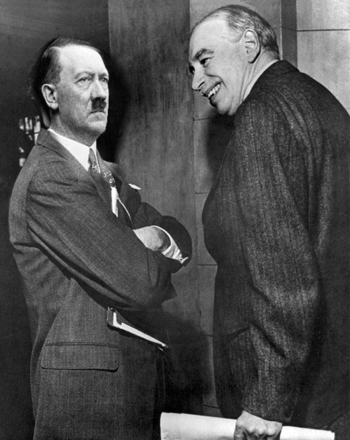

## Keynsian Economics

## <font color="white">Lord Keynes (1883-1946) {data-background="img/LordKeynes.jpg"}

- A Treatise on Money (1930)
- The General Theory of Employment, Interest and Money (1936)

</font>

## <font color="white"> Unemployment {data-background="img/LordKeynes.jpg"}

- Neoclassical Economics
- The Great Crash (and subsequent Depression)

</font>

## The Great Crash

- What would you do?

## <font color="white"> Crisis of Demand {data-background="img/LordKeynes.jpg"}

- Wages are not flexible
- But, that is not the problem!

</font>

## <font color="white"> Keynes's Solution: {data-background="img/LordKeynes.jpg"}

<q> "$Y=C+I+G+X-M$" </q>

- Step 1: Be the State
- Step 2: Increase aggregate demand

</font>

## <font color="white"> "Pre-Keynesians"? {data-background="img/LordKeynes.jpg"}

- FDR's New Deal
- Stalin provided full employment and avoided the Great Depression!
- ... But instituted structural change that killed $\pm$ 10m

</font>

##
<q> "The true protagonist of the Kynsian ideas." - Galbraith (1977)</q>

<p class="fragment">
```{r,  out.width = "400px", echo=F}

```
</p>

## <font color="white">Keynes's confusing legacy {data-background="img/LordKeynes.jpg"}

- Post-Keynesianism <p class="fragment"> $\neq$ Neo-Keynesianism </p> <p class="fragment"> $\neq$ New Keynesianism </p>

</font>